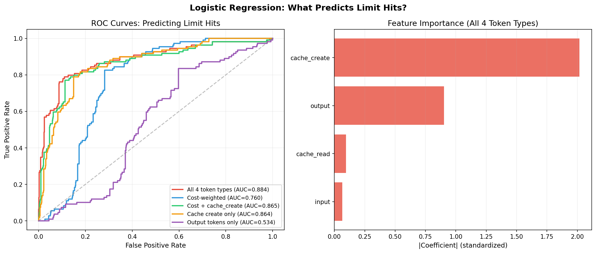
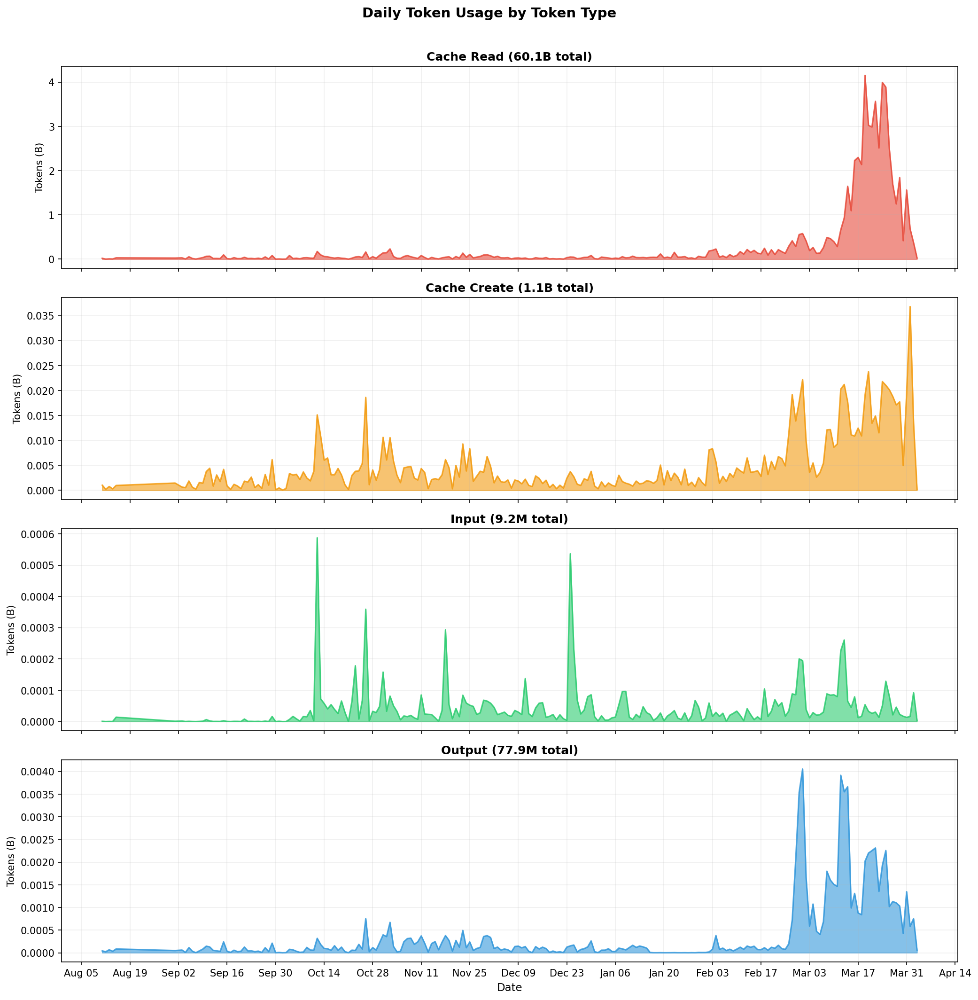
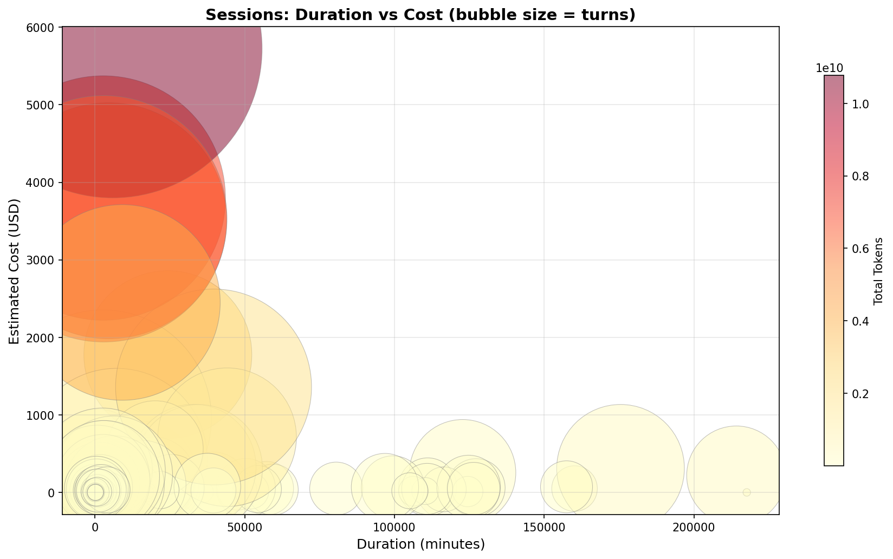
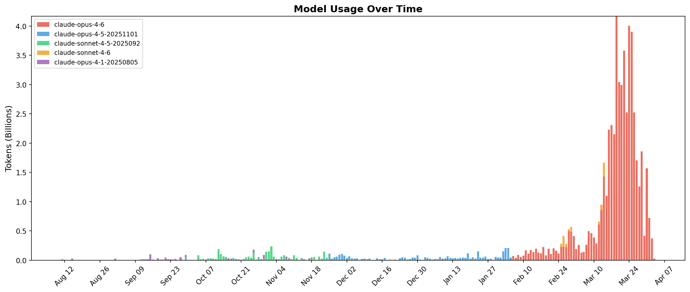
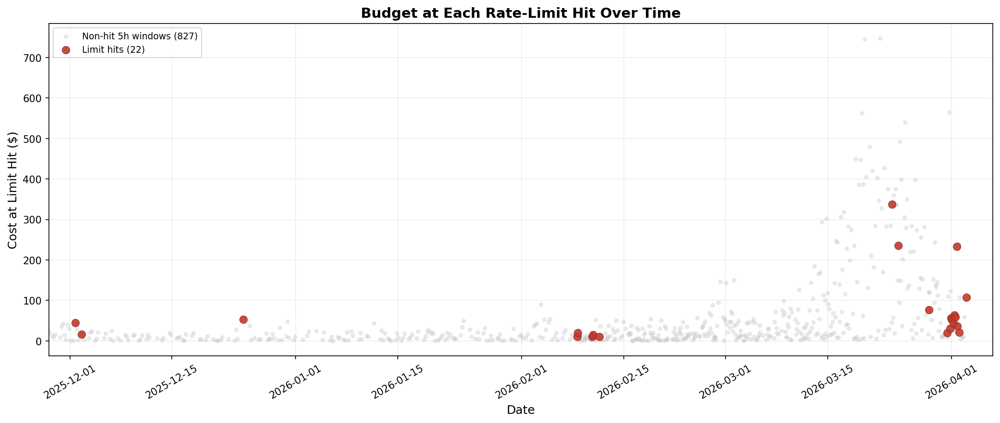
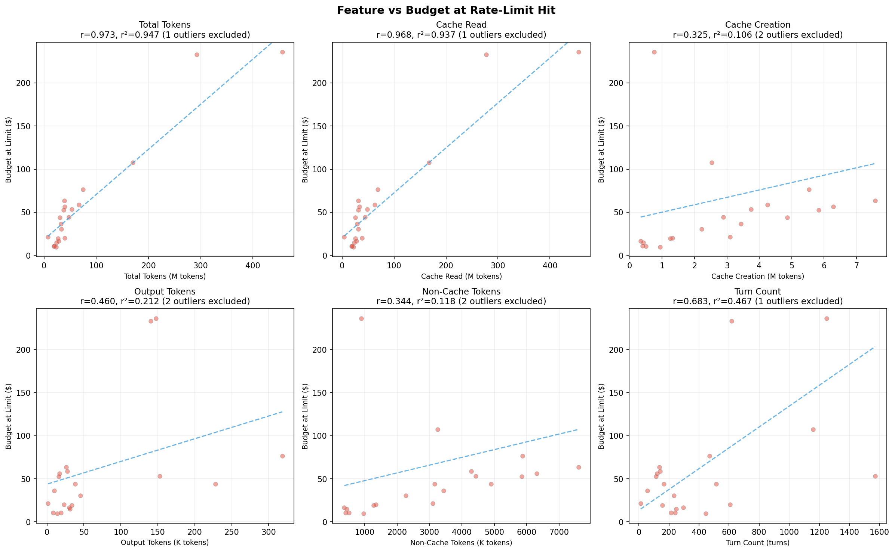

# Where's My Tokens?

**Find out what's actually burning through your Claude Code session limits.**

Claude Code tells you "80% used" but not *why*. The usage bar doesn't break down which project, model, or token type is eating your 5-hour window. This tool parses your local `~/.claude/` data to show you exactly where your budget goes — and uses machine learning on your real rate-limit events to reverse-engineer Anthropic's formula.

## The Surprising Finding

I ran logistic regression on 100+ real rate-limit events and found:

- **Cache creation is the hidden limit driver:** It's the strongest single predictor of hitting a limit—far stronger than output tokens alone.
- **The formula is a weighted combination:** No single token type tells the whole story, which is why your budget is so hard to intuit.
- **API cost is a good proxy, but not perfect:** Anthropic appears to weight cache creation more heavily than their public API pricing implies.


*(Run `wheres-my-tokens analyze` to reproduce this on your own data)*

## Understand Your Usage

Run `wheres-my-tokens visualize` to generate shareable charts of your actual consumption:



## Install

```bash
# Option 1: pipx (recommended — no venv needed)
pipx install git+https://github.com/theangrydev/wheres-my-tokens.git

# Option 2: pip in a venv
git clone https://github.com/theangrydev/wheres-my-tokens.git
cd wheres-my-tokens
python3 -m venv .venv && source .venv/bin/activate
pip install -e .
```

## Quick Start

```bash
# What's eating my limits? (start here)
wheres-my-tokens limits

# Quick overview
wheres-my-tokens summary

# Generate shareable charts
wheres-my-tokens visualize

# Run all reports
wheres-my-tokens all
```

## What You'll Learn

### `limits` — The main report
Shows where your limit budget goes (cost-weighted token usage), broken down by:
- **Action type**: writing code, running commands, text responses...
- **Model**: which models cost the most per turn
- **Project**: which codebases consume the most budget
- **Session length**: cost per turn grows in longer sessions

Ends with ranked recommendations based on your actual data.

### `summary` — Quick overview
Total tokens, model breakdown, per-profile stats.

### `daily` — Trends over time
Daily usage, spike days, day-of-week patterns.

### `visualize` — Shareable charts

Generate shareable PNG charts displaying your usage data.

#### Sessions by duration vs cost


#### Model usage migration over time


*(Note: The Daily Usage chart at the top of this document is also generated by this command)*

### `analyze` — Advanced
Reverse-engineer the limit formula using your actual rate-limit events. Generates budget timelines, scatter plots, and logistic regression charts.

#### Budget at each rate-limit hit over time


#### Feature correlations with limit hits


*(Note: The Logistic Regression chart shown earlier is also generated by this command)*

## Filtering

```bash
wheres-my-tokens --since 2025-03-01 limits          # last month
wheres-my-tokens --project my-app limits            # specific project
wheres-my-tokens --model opus limits                # specific model
wheres-my-tokens --profile-filter claude-other all  # specific profile
```

## Configuration

Edit `config.yaml` for model pricing and settings.

## How It Works

Streams through `~/.claude/projects/**/*.jsonl` files, deduplicates by `requestId`, and builds a database of API turns with token breakdowns. First run takes ~30s; subsequent runs use a pickle cache.

**Key assumption**: Each profile directory (e.g. `~/.claude`, `~/.claude-other`) is treated as a separate account with independent usage limits. Multiple concurrent sessions within the same profile all count toward its shared 5-hour budget.

Uses `<synthetic>` rate-limit messages as ground truth calibration points for the limit model.

## Requirements

- Python 3.10+
- Claude Code local data in `~/.claude/`

## License

MIT
