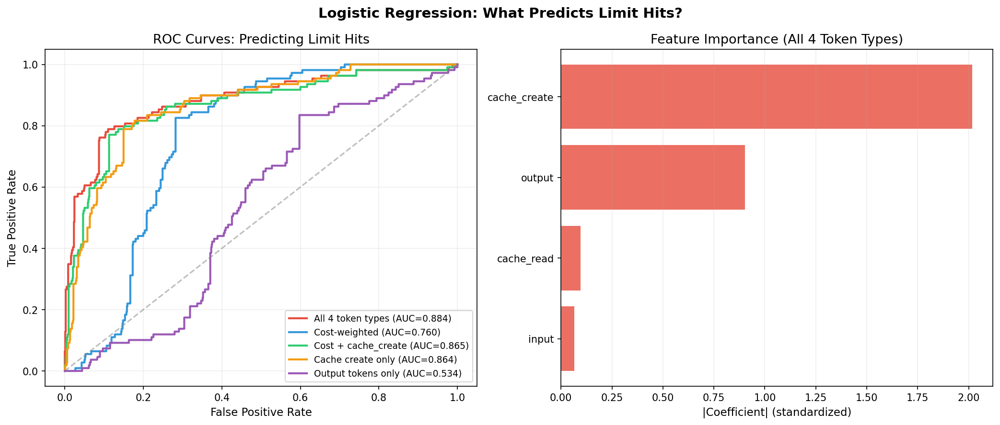
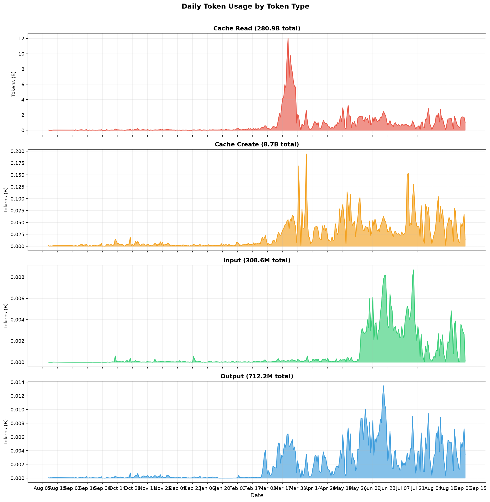
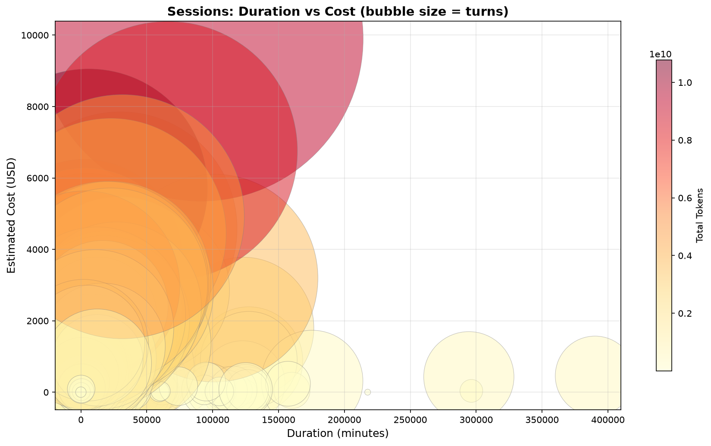
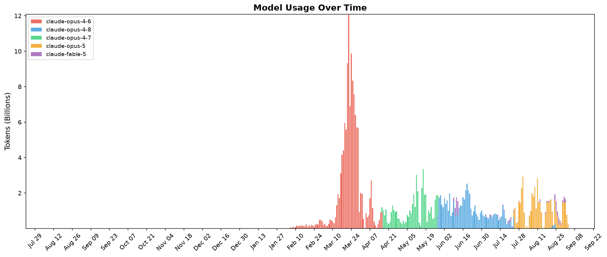
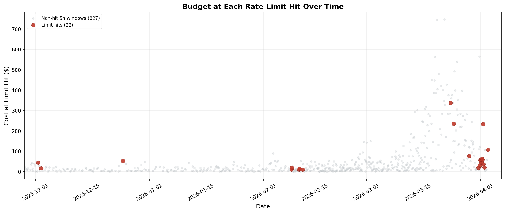
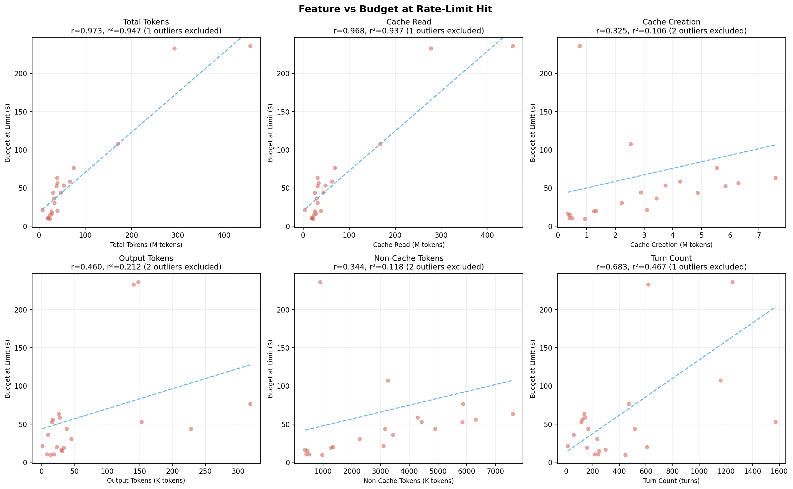

# Where's My Tokens?

**Find out what's actually burning through your Claude Code session limits.**

Claude Code tells you "80% used" but not *why*. The usage bar doesn't break down which project, model, or token type is eating your session limit, and it says nothing at all about the separate weekly cap. This tool parses your local `~/.claude/` data to show you exactly where your budget goes — and uses machine learning on your real rate-limit events to reverse-engineer Anthropic's formula.

There are **two** limits, they behave differently, and which one binds you depends entirely on how you work. Short bursty sessions hit the 5-hour one; anything running continuously hits the weekly one and never sees the other. `analyze` fits them separately.

## The Surprising Finding

Logistic regression over ~1.4M real turns and every rate-limit event in them, fitted separately for each limit:

| model | 5-hour limit | weekly limit |
|---|---:|---:|
| cache creation only | **0.8006** | 0.9056 |
| cost + cache creation | 0.8001 | 0.9146 |
| all four token types | 0.7995 | **0.9249** |
| cost-weighted (API $) | 0.7388 | 0.7907 |
| cache **reads** only | 0.6613 | 0.7125 |

*(AUC. 88 hit / 2,440 control windows for the 5-hour fit; 44 / 590 for the weekly one.)*

- **Cache creation is the limit driver, in both buckets.** For the 5-hour limit it alone is the *best* model — adding the other three token types makes it slightly worse. For the weekly limit it carries a standardised coefficient of **+2.2**, several times anything else.
- **Dollar cost is not what's being metered.** Pair cost with cache creation and cost's coefficient goes **negative** in both fits (-0.04 and -0.54): once you know how much cache a window wrote, spending *more* predicts *fewer* limit hits. Cache creation is worth +0.06 AUC over cost alone on the 5-hour limit and +0.12 on the weekly one.
- **The two limits behave differently and need separate models.** The 5-hour limit is driven almost entirely by one feature; the weekly limit genuinely is a weighted combination. Fitting them together — which this tool did for months — is worth roughly -0.14 AUC.
- **Cache reads are a red herring.** They are ~97% of all tokens and among the *weakest* discriminators in both fits. The number that dominates every usage dashboard is close to the least useful one to act on.


*(Run `wheres-my-tokens analyze` to reproduce this on your own data)*

**Caveat on the weekly numbers:** its control windows overlap (see `analyze` below), so its AUC is a ranking rather than a calibrated probability, and its apparent edge over the 5-hour model is not a like-for-like comparison.

## Understand Your Usage

Run `wheres-my-tokens visualize` to generate shareable charts of your actual consumption:



## Install

```bash
# Option 1: pipx (recommended — no venv needed)
pipx install git+https://github.com/theangrydev/wheres-my-tokens.git

# Option 2: pip in a venv
git clone https://github.com/theangrydev/wheres-my-tokens.git
cd wheres-my-tokens
python3 -m venv .venv && source .venv/bin/activate
pip install -e .
```

## Quick Start

```bash
# What's eating my limits? (start here)
wheres-my-tokens limits

# Quick overview
wheres-my-tokens summary

# Generate shareable charts
wheres-my-tokens visualize

# Run all reports
wheres-my-tokens all
```

## What You'll Learn

### `limits` — The main report
Shows where your limit budget goes (cost-weighted token usage), broken down by:
- **Action type**: writing code, running commands, text responses...
- **Model**: which models cost the most per turn
- **Project**: which codebases consume the most budget
- **Session length**: cost per turn grows in longer sessions

Ends with ranked recommendations based on your actual data.

### `summary` — Quick overview
Total tokens, model breakdown, per-profile stats.

### `daily` — Trends over time
Daily usage, spike days, day-of-week patterns.

### `visualize` — Shareable charts

Generate shareable PNG charts displaying your usage data.

#### Sessions by duration vs cost


#### Model usage migration over time


*(Note: The Daily Usage chart at the top of this document is also generated by this command)*

### `analyze` — Advanced
Reverse-engineer the limit formula using your actual rate-limit events. Generates budget timelines, scatter plots, and logistic regression charts.

```bash
wheres-my-tokens analyze                    # both limits (default)
wheres-my-tokens analyze --window 5h        # the 5-hour session limit only
wheres-my-tokens analyze --window 1w        # the weekly limit only
wheres-my-tokens analyze --group-by dir     # per directory, not per account
```

Each window writes its charts to its own `output/<window>/` subdirectory, so the two passes never overwrite each other and can be compared side by side.

A caveat on the weekly fit: control windows are sampled daily rather than weekly, because a week-long window stepped by a week yields only ~45 controls per account per year. Those controls overlap and so are not independent samples — read the weekly AUC as a ranking, not as a calibrated probability, and don't compare its confidence to the 5-hour model's.

#### Budget at each rate-limit hit over time


#### Feature correlations with limit hits


*(Note: The Logistic Regression chart shown earlier is also generated by this command)*

## Filtering

```bash
wheres-my-tokens --since 2025-03-01 limits          # last month
wheres-my-tokens --project my-app limits            # specific project
wheres-my-tokens --model opus limits                # specific model
wheres-my-tokens --profile-filter claude-other all  # specific profile
```

## Configuration

Edit `config.yaml` for model pricing and settings.

## How It Works

Streams through `~/.claude/projects/**/*.jsonl` files, deduplicates by `requestId`, and builds a database of API turns with token breakdowns. First run takes ~30s; subsequent runs use a pickle cache.

Uses rate-limit messages in the transcripts as ground-truth calibration points for the limit model.

**Budgets are per ACCOUNT, not per directory.** Several profile directories can be logged into the same account (`~/.claude`, `~/.claude-work`, or a fleet of agents all using one login). They then share one budget, and every one of them logs the *same* limit event independently. `analyze` resolves each directory to its account via the OAuth email in `.claude.json` and aggregates there. Pass `--group-by dir` for the old per-directory view, but expect it to undercount: a window filtered to the single directory that happened to log the error misses the usage from every sibling directory that helped cause it.

## Gotchas worth knowing (learned the hard way)

Some of these cost weeks of silently wrong output. They generalise well beyond this tool.

**A string-matching classifier fails silently, so it needs an alarm.** Anthropic reworded the limit message in mid-2026: `"You've hit your limit"` became `"You've hit your weekly limit"` and `"You've hit your session limit"`. The classifier tested for the old substring, which matches neither. Every event for months fell through to `unknown`, downstream stages filter on the type, and the result was not an error — it was empty charts and a timeline that quietly stopped months earlier. `analyze` now warns when >2% of events are unclassified and prints the unmatched text. That alarm found a *second* rename on its first run.

**Don't infer a category from an incidental detail.** The old code decided weekly-vs-session by whether the message quoted a date, on the theory that only weekly resets are far enough out to need one. Both directions are wrong: a session limit hit late in the evening quotes tomorrow's date because the reset crosses midnight, and a weekly limit that resets today quotes a bare time. It now computes the actual reset delta from the message and the event timestamp.

**Don't mix two populations in one model.** The 5-hour and weekly limits are separate buckets with separate causes. Labelling the 5 hours before a *weekly* hit as a positive teaches the model that ordinary usage hits limits — those 5 hours are usually unremarkable. Separating them was worth roughly +0.14 AUC across every model variant. They now get separate fits, separate windows and separate output directories.

**Correlation is not discrimination.** Cache *reads* are the second-strongest correlate of budget-at-limit, and one of the *weakest* discriminators between a window that hit a limit and one that didn't. They are ~97% of all tokens, so they correlate with everything. The biggest number on the dashboard was the least useful one to optimise.

**Count the event, not the log lines.** One limit produces a retry message every few minutes for as long as it holds — days, for a weekly limit — and every profile directory sharing the account logs all of them. Naively that is hundreds of near-identical rows in the training set. Every retry quotes the *same* reset time, so the quoted reset is the event's real identity.

## Requirements

- Python 3.10+
- Claude Code local data in `~/.claude/`

## License

MIT
